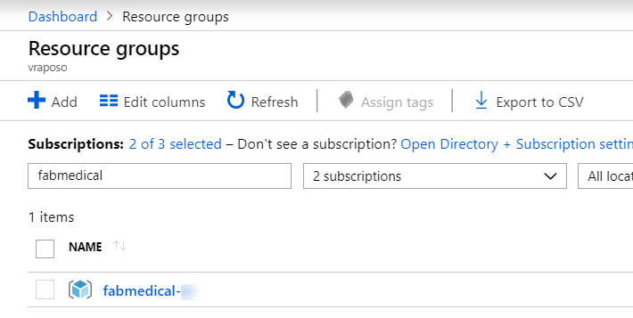
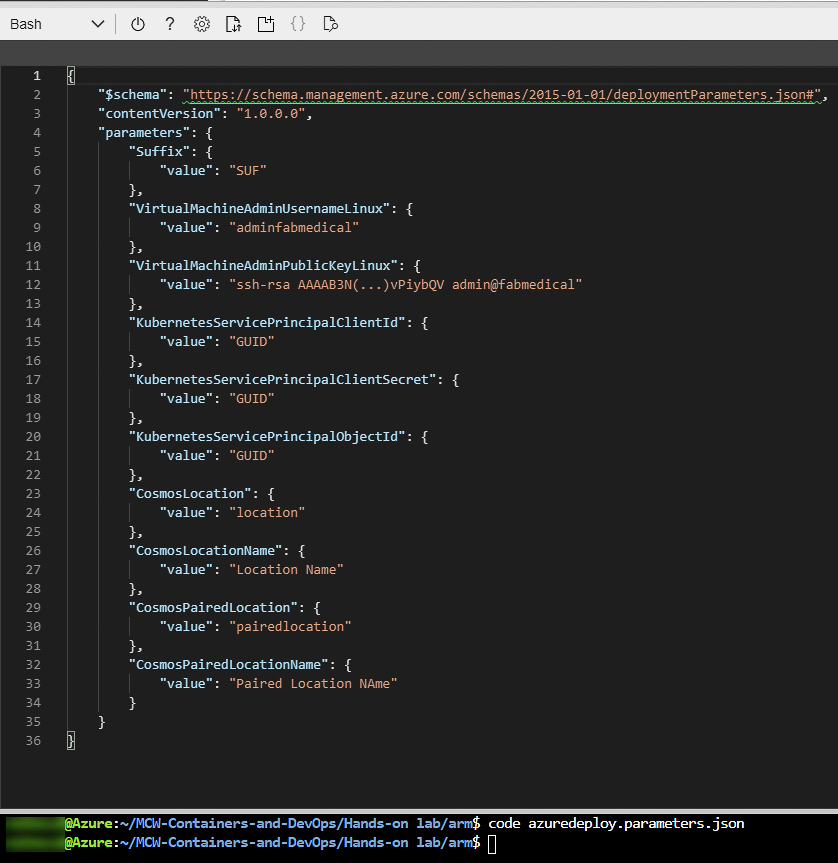
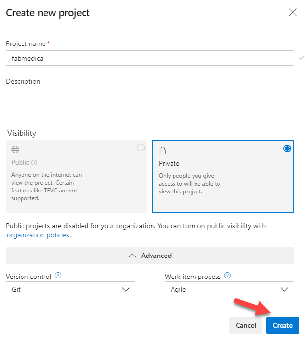
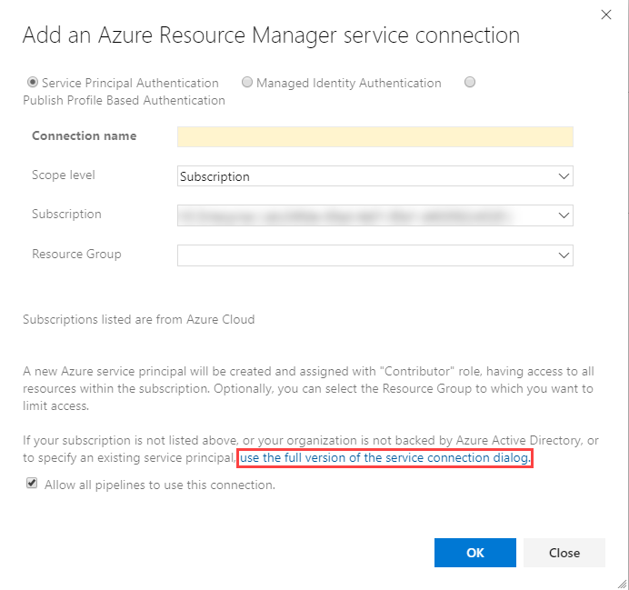
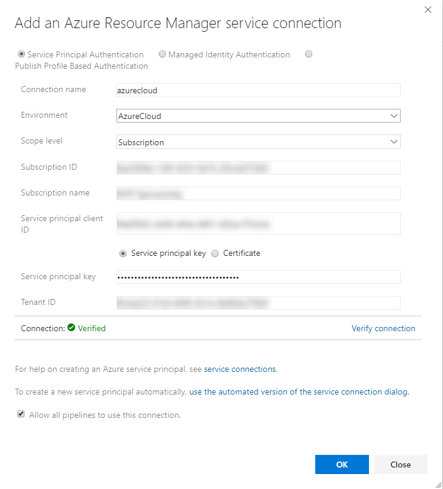
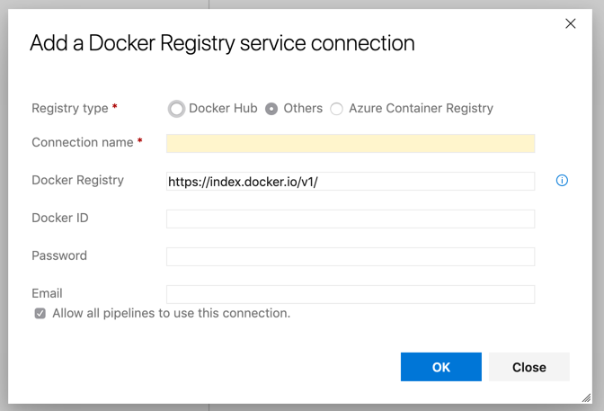
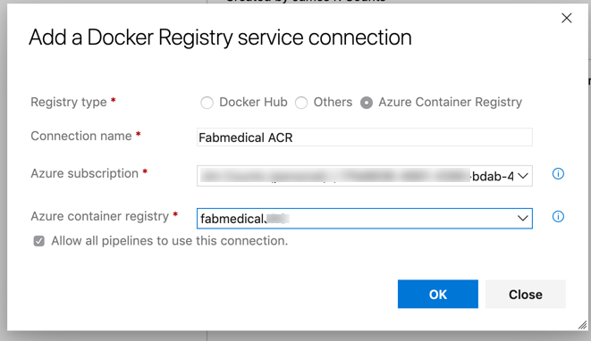

# Cloud-native applications before the hands-on lab setup guide

## Contents

<!-- TOC -->

- [Cloud-native applications before the hands-on lab setup guide](#cloud-native-applications-before-the-hands-on-lab-setup-guide)
  - [Requirements](#requirements)
  - [Before the hands-on lab](#before-the-hands-on-lab)
    - [Task 1: Setup Azure Cloud Shell](#task-1-setup-azure-cloud-shell)
    - [Task 2: Download Starter Files](#task-2-download-starter-files)
    - [Task 3: Resource Group](#task-3-resource-group)
    - [Task 4: Create an SSH key](#task-4-create-an-ssh-key)
    - [Task 5: Create a Service Principal](#task-5-create-a-service-principal)
    - [Task 6: Deploy ARM Template](#task-6-deploy-arm-template)
    - [Task 7: Setup Azure DevOps project](#task-7-setup-azure-devops-project)
    - [Task 8: Connect securely to the build agent](#task-8-connect-securely-to-the-build-agent)
    - [Task 9: Complete the build agent setup](#task-9-complete-the-build-agent-setup)
    - [Task 10: Clone Repositories to the Build Agent](#task-10-clone-repositories-to-the-build-agent)

<!-- /TOC -->

## Requirements

1. Microsoft Azure subscription must be pay-as-you-go or MSDN.

   - Trial subscriptions will _not_ work.

   - To complete this lab setup (including [Task 5: Create a Service Principal](#Task-5-Create-a-Service-Principal)) ensure your account includes the following:

     - Has the [Owner](https://docs.microsoft.com/en-us/azure/role-based-access-control/built-in-roles#owner) built-in role for the subscription you use.

     - Is a [Member](https://docs.microsoft.com/en-us/azure/active-directory/fundamentals/users-default-permissions#member-and-guest-users) user in the Azure AD tenant you use. (Guest users will not have the necessary permissions).

     > **Note** If you do not meet these requirements, ask another member user with subscription owner rights to login to the portal and execute the task to create the service principal.

   - You must have enough cores available in your subscription to create the build agent and Azure Kubernetes Service cluster in [Task 6: Deploy ARM Template](#Task-6-Deploy-ARM-Template). You'll need eight cores if following the exact instructions in the lab, more if you choose additional agents or larger VM sizes. Execute the steps required before the lab to see if you need to request more cores in your sub.

2. An account in Azure DevOps.

3. Local machine or a virtual machine configured with:

   - A browser, preferably Chrome for consistency with the lab implementation tests.

4. You will be asked to install other tools throughout the exercises.

## Before the hands-on lab

**Duration**: 1 hour

You should follow all of the steps provided in this section _before_ taking part in the hands-on lab ahead of time as some of these steps take time.

### Task 1: Setup Azure Cloud Shell

1. Open a cloud shell by selecting the cloud shell icon in the menu bar.

   

2. The cloud shell opens in the browser window. Choose "Bash" if prompted or use the left-hand dropdown on the shell menu bar to choose "Bash" (as shown).

   

3. You should make sure to set your default subscription correctly. To view your current subscription type:

   ```bash
   az account show
   ```

   

4. To list all of your subscriptions, type:

   ```bash
   az account list
   ```

   

5. To set your default subscription to something other than the current selection, type the following, replacing {id} with the desired subscription id value:

   ```bash
   az account set --subscription {id}
   ```

### Task 2: Download Starter Files

In this task, you use `git` to copy the lab content to your cloud shell so that the lab starter files will be available.

> **Note**: If you don't have a cloud shell available, refer back to [Task 1: Setup Azure Cloud Shell](#task-1-setup-azure-cloud-shell).

1. Type the following command and press `<ENTER>`:

   ```bash
   git clone https://github.com/microsoft/MCW-Cloud-native-applications.git
   ```

2. The lab files download.

   

3. We do not need the `.git` folder, and later steps will be less complex if we remove it. Run this command:

   ```bash
   rm -rf MCW-Cloud-native-applications/.git
   ```

### Task 3: Resource Group

Create an Azure Resource Group to hold most of the resources that you create in this hands-on lab. This approach makes it easier to clean up later.

1. In your cloud shell window, you type a command similar to the following command:

   > **Note**: If you don't have a cloud shell available, refer back to [Task 1: Setup Azure Cloud Shell](#task-1-setup-azure-cloud-shell).

   ```bash
   az group create -l [LOCATION] -n fabmedical-[SUFFIX]
   ```

   - **Suffix:** Throughout the lab, suffix should be used to make resources unique, like your email prefix or your first initial and last name.

   - **Location:** Choose a region where all Azure Container Registry SKUs have to be available, which is currently: Canada Central, Canada East, North Central US, Central US, South Central US, East US, East US 2, West US, West US 2, West Central US, France Central, UK South, UK West, North Europe, West Europe, Australia East, Australia Southeast, Brazil South, Central India, South India, Japan East, Japan West, Korea Central, Southeast Asia, East Asia, and remember this for future steps so that the resources you create in Azure are all kept within the same region.

   Example:

   ```bash
   az group create -l westus -n fabmedical-sol
   ```

2. When this completes, the Azure Portal shows your Resource Group.

   

### Task 4: Create an SSH key

You create VMs during the upcoming exercises. In this section, you create an SSH key to access the VMs securely.

1. From the cloud shell command line, enter the following command to ensure that a directory for the SSH keys exists. You can ignore any errors you see in the output.

   > **Note**: If you don't have a cloud shell available, refer back to [Task 1: Setup Azure Cloud Shell](#task-1-setup-azure-cloud-shell).

   ```bash
   mkdir .ssh
   ```

2. From the cloud shell command line, enter the following command to generate an SSH key pair. You can replace "admin" with your preferred name or handle.

   ```bash
   ssh-keygen -t RSA -b 2048 -C admin@fabmedical
   ```

3. When asked to save the generated key to a file, enter `.ssh/fabmedical` for the name.

4. Enter a passphrase when prompted, and **don't forget it**!

5. Because you entered ".ssh/fabmedical", ssh-keygen generates the file in the ".ssh" folder in your user folder, where the cloud shell opens by default.

6. Keep this cloud shell open and remain in the default directory. You use this shell in later tasks.

   

### Task 5: Create a Service Principal

Azure Kubernetes Service requires an Azure Active Directory service principal to interact with Azure APIs. The service principal is needed to dynamically manage resources such as user-defined routes and the Layer 4 Azure Load Balancer. The easiest way to set up the service principal is by using the Azure cloud shell.

> **Note**: To complete this task, ensure your account is an [Owner](https://docs.microsoft.com/en-us/azure/role-based-access-control/built-in-roles#owner) built-in role for the subscription you use and is a [Member](https://docs.microsoft.com/en-us/azure/active-directory/fundamentals/users-default-permissions#member-and-guest-users) user in the Azure AD tenant you use. You may have trouble creating a service principal if you do not meet these requirements.

1. To create a service principal, type the following command in the cloud shell command line, replacing {id} with your subscription identifier, and replacing suffix with your chosen suffix to make the name unique:

   > **Note**: If you don't have a cloud shell available, refer back to [Task 1: Setup Azure Cloud Shell](#task-1-setup-azure-cloud-shell).

   ```bash
   az ad sp create-for-rbac --role="Contributor" --scopes="/subscriptions/{id}" --name="http://Fabmedical-sp-{SUFFIX}"
   ```

2. The command produces output like this. Copy this information to use later.

   

3. To get the service principal object id, type the following command, replacing {appId} with your service principal appId:

   ```bash
   az ad sp show --id {appId} --query "{objectId:@.objectId}"
   ```

4. The command produces output like this. Copy this information to use later.

   

### Task 6: Deploy ARM Template

In this section, you configure and execute an ARM template that creates all the resources that you need throughout the exercises.

1. In Azure cloud shell, switch to the ARM template directory:

   > **Note**: If you don't have a cloud shell available, refer back to [Task 1: Setup Azure Cloud Shell](#task-1-setup-azure-cloud-shell).

   ```bash
   cd MCW-Cloud-native-applications/Hands-on\ lab/arm/
   ```

2. Open the azuredeploy.parameters.json file for editing using Azure Cloud Shell editor.

   ```bash
   code azuredeploy.parameters.json
   ```

   

3. Update the values for the various keys so that they match your environment:

   - **Suffix**: Enter a shortened version of your SUFFIX with a max of 3 chars.
   - **VirtualMachineAdminUsernameLinux**: The Linux Build Agent VM admin username (example: `"adminfabmedical"`).
   - **VirtualMachineAdminPublicKeyLinux**: The Linux Build Agent VM admin ssh public key. You find this value in the `.ssh/fabmedical.pub` file created previously (example: `"ssh-rsa AAAAB3N(...)vPiybQV admin@fabmedical"`).
   - **KubernetesServicePrincipalClientId**: The Kubernetes Cluster Service Principal Client Id. Use the service principal “appId” from a previous step.
   - **KubernetesServicePrincipalClientSecret**: The Kubernetes Cluster Service Principal Client Secret. Use the service principal “password” from a previous step.
   - **KubernetesServicePrincipalObjectId**: The Kubernetes Cluster Service Principal Object Id. Use the service principal “objectId” from a previous step.
   - **CosmosLocation**: The primary location of the Azure Cosmos DB. Use the same location as the resource group previously created (example: `"eastus"`).
   - **CosmosLocationName**: The name of the primary location of the Azure Cosmos DB. Use the name of the same location as the resource group previously created (example: `"East US"`).
   - **CosmosPairedLocation**: The secondary location of the Azure Cosmos DB. Use a location from the list below (example: `"westus"`).
   - **CosmosPairedLocationName**: The name of the secondary location of the Azure Cosmos DB. Use the location name from the list below that matches the secondary location defined in the previous key (example: `"West US"`).

   | Location           | Location Name       |
   | ------------------ | ------------------- |
   | canadacentral      | Canada Central      |
   | canadaeast         | Canada East         |
   | northcentralus     | North Central US    |
   | centralus          | Central US          |
   | southcentralus     | South Central US    |
   | eastus             | East US             |
   | eastus2            | East US 2           |
   | westus             | West US             |
   | westus2            | West US 2           |
   | westcentralus      | West Central US     |
   | francecentral      | France Central      |
   | uksouth            | UK South            |
   | ukwest             | UK West             |
   | northeurope        | North Europe        |
   | westeurope         | West Europe         |
   | australiaeast      | Australia East      |
   | australiasoutheast | Australia Southeast |
   | brazilsouth        | Brazil South        |
   | centralindia       | Central India       |
   | southindia         | South India         |
   | japaneast          | Japan East          |
   | japanwest          | Japan West          |
   | koreacentral       | Korea Central       |
   | southeastasia      | Southeast Asia      |
   | eastasia           | East Asia           |

4. Select the **...** button and select **Save**.

   

5. Select the **...** button again and select **Close Editor**.

   

6. Create the needed resources by typing the following instruction (case sensitive), replacing {resourceGroup} with the name of the previously created resource group:

   ```bash
   az group deployment create --resource-group {resourceGroup} --template-file azuredeploy.json --parameters azuredeploy.parameters.json
   ```

   This command takes up to 30 to 60 minutes to deploy all lab resources. You can continue to the next task to setup Azure DevOps while the deployment runs.

### Task 7: Setup Azure DevOps project

FabMedical has provided starter files for you. They have taken a copy of the websites for their customer Contoso Neuro and refactored it from a single node.js site into a website with a content API that serves up the speakers and sessions. This refactored code is a starting point to validate the containerization of their websites. Use this to help them complete a POC that validates the development workflow for running the website and API as Docker containers and managing them within the Azure Kubernetes Service environment.

1. Open a **new** Azure Cloud Shell console.

2. Navigate to the FabMedical source code folder and list the contents.

   ```bash
   cd ~/MCW-Cloud-native-applications/Hands-on\ lab/lab-files/developer/
   ll
   ```

   > **Important note**: If you will be taking the Infrastructure edition of the lab, instead of using the above instructions, type the following ones:
   >
   > ```bash
   > cd ~/MCW-Cloud-native-applications/Hands-on\ lab/lab-files/infrastructure/
   > ll
   > ```
   >
   > This will take you to the version of the starter files that will be used by that edition of the lab.

3. You'll see the listing includes three folders, one for the web site, another
   for the content API and one to initialize API data:

   ```bash
   content-api/
   content-init/
   content-web/
   ```

4. Set your username and email, which git uses for commits.

   ```bash
   git config --global user.email "you@example.com"
   git config --global user.name "Your Name"
   ```

5. Configure git CLI to cache your credentials, so that you don't have to keep
   re-typing them.

   ```bash
   git config --global credential.helper cache
   ```

6. Open a new browser tab to visit [Azure DevOps][devops] and log into your
   account.

   If you have never logged into this account, Azure DevOps takes you through a first-run experience:

   - Confirm your contact information and select next.
   - Select "Create new account".
   - Enter a fabmedical-SUFFIX for your account name and select Continue.

7. Create an Azure DevOps Project.

   - Enter fabmedical as the project name.
   - Ensure the project is Private.
   - Choose the "Advanced" dropdown.
   - Ensure the Version control is set to Git.
   - Select the "Create" button.

   

8. Enable multi-stage pipelines:

   - Select your user icon in the top right corner.
   - Then choose the three dots to access the "Preview Features" menu item.
   - Toggle multi-stage pipelines to "On".

9. Next, add an Azure Service Connection to your Azure DevOps account. Select the
   Project settings gear icon to access your settings. Then select Service Connections.

10. Choose "+ New service connection". Then pick "Azure Resource Manager" from
    the menu.

    

11. Select the link indicated in the screenshot below to access the advanced settings.

    

12. Enter the required information using the service principal information you
    created earlier.

    - **Connection name**: azurecloud
    - **Environment**: AzureCloud
    - **Scope Level**: Subscription
    - **Subscription ID**: `id` from `az account show` output
    - **Subscription name**: `name` from `az account show` output
    - **Service principal client ID**: `appId` from service principal output.
    - **Service principal key**: `password` from service principal output.
    - **Tenant ID**: `tenant` from service principal output.

    

13. Select "Verify connection" then select "OK".

    > **Note**: If the connection does not verify, then recheck and reenter the required data.

14. Next, add another Azure Service Connection to your Azure DevOps account.
    Select the Project settings gear icon to access your settings. Then choose
    Service Connections.

15. Choose "+ New service connection". Then pick "Docker Registry" from
    the menu.

    

16. Enter the required information using the service principal information you
    created earlier.

    - **Environment**: Azure Container Registry

    - **Connection name**: Fabmedical ACR

    - **Azure Subscription**: Choose the subscription you are using for the lab

    - **Azure Container Registry**: Choose the registry created for you by the ARM deployment

    

17. Select "OK".

18. Next, choose "Repos" then use the repository dropdown to create a new
    repository by selecting "+ New repository".

    

    - Enter "content-web" as the repository name.

    - Once Azure DevOps creates the repository, select "Generate Git credentials".

    

19. Copy the Personal Access Token and save it for later steps

20. Using your cloud shell window, initialize a new git repository for `content-web`.

    ```bash
    cd content-web
    git init
    git add .
    git commit -m "Initial Commit"
    ```

21. Return to your Azure DevOps tab and copy the commands to add your Azure DevOps repository as a new remote for
    push. Copy the commands for "**HTTPS**" similar to this example:

    ```bash
    git remote add origin https://fabmedical-sol@dev.azure.com/fabmedical-sol/fabmedical/_git/content-web
    git push -u origin --all
    ```

22. Now use the commands copied from Azure DevOps to configure the remote repository and push the code to Azure DevOps. When prompted for a password, paste your Azure DevOps Personal Access Token you copied earlier in this task.

23. Return to Azure DevOps and use the repository dropdown to create a second repository called `content-api`.

    > Note: You do not need to generate git credentials again. The same PAT works for both repositories.

24. Using your cloud shell window, initialize a new git repository in the `content-api` directory.

    ```bash
    cd ../content-api
    git init
    git add .
    git commit -m "Initial Commit"
    ```

25. Copy the commands to add your `content-api` repository as a new remote for push. Copy the commands for "**HTTPS**".

26. Now use the commands copied from Azure DevOps to configure the remote repository and push the code to Azure DevOps. If prompted for a password, paste your Azure DevOps Personal Access Token you copied earlier in this task.

27. Use the repository drop down to create a third repository called
    `content-init`.

    > Note: You do not need to generate git credentials again. The same PAT works for both repositories.

28. Using your cloud shell window, initialize a new git repository in the `content-init` directory.

    ```bash
    cd ../content-init
    git init
    git add .
    git commit -m "Initial Commit"
    ```

29. Copy the commands to add your `content-init` repository as a new remote for push. Copy the commands for "**HTTPS**".

30. Now use the commands copied from Azure DevOps to configure the remote repository and push the code to Azure DevOps. If prompted for a password, paste your Azure DevOps Personal Access Token you copied earlier in this task.

### Task 8: Connect securely to the build agent

In this section, you validate that you can connect to the new build agent
VM.

1. Open a **new** Azure Cloud Shell console and run the following command to find the IP address for
   the build agent VM provisioned when you ran the ARM deployment:

   > **Note**: If you don't have a cloud shell available, refer back to [Task 1: Setup Azure Cloud Shell](#task-1-setup-azure-cloud-shell).

   ```bash
   az vm show -d -g fabmedical-[SUFFIX] -n fabmedical-[SHORTssh  SUFFIX] --query publicIps -o tsv
   ```

   Example:

   ```bash
   az vm show -d -g fabmedical-sol -n fabmedical-SOL --query publicIps -o tsv
   ```

2. In the cloud shell output, take note of the public IP address for the VM.

   

3. Connect to the new VM you created by typing the following command:

   ```bash
    ssh -i [PRIVATEKEYNAME] [BUILDAGENTUSERNAME]@[BUILDAGENTIP]
   ```

   Replace the bracketed values in the command as follows:

   - [PRIVATEKEYNAME]: Use the private key name ".ssh/fabmedical," created above.

   - [BUILDAGENTUSERNAME]: Use the username for the VM, such as adminfabmedical.

   - [BUILDAGENTIP]: The IP address for the build agent VM, retrieved in the previous step

   ```bash
   ssh -i .ssh/fabmedical adminfabmedical@52.174.141.11
   ```

4. When asked to confirm if you want to connect, as the authenticity of the connection cannot be validated, type "yes".

5. When asked for the passphrase for the private key you created previously, enter this value.

6. SSH connects to the VM and displays a command prompt such as the following. Keep this cloud shell window open for the next step:

   `adminfabmedical@fabmedical-SUFFIX:~$`

   

> **Note**: If you have issues connecting, you may have pasted the SSH public key incorrectly in the ARM template. Unfortunately, if this is the case, you will have to recreate the VM and try again.

### Task 9: Complete the build agent setup

In this task, you update the packages and install the Docker engine.

1. Go to the cloud shell window that has the SSH connection open to the build agent VM.

2. Update the Ubuntu packages and install curl and support for repositories over HTTPS in a single step by typing the following in a single line command. Respond by typing "Y" and pressing enter, if asked if you would like to proceed.

   ```bash
   sudo apt-get update && sudo apt install apt-transport-https ca-certificates curl software-properties-common
   ```

3. Add Docker's official GPG key by typing the following in a single line command:

   ```bash
   curl -fsSL https://download.docker.com/linux/ubuntu/gpg | sudo apt-key add -
   ```

4. Add Docker's stable repository to Ubuntu packages list by typing the following in a single line command:

   ```bash
   sudo add-apt-repository "deb [arch=amd64] https://download.docker.com/linux/ubuntu $(lsb_release -cs) stable"
   ```

5. Add NodeJs PPA to use NodeJS LTS release and update the Ubuntu packages and install Docker engine, node.js, and the node package manager by typing the following commands, each on their own line. If asked if you would like to proceed, respond by typing "Y" and pressing enter.

   ```bash
   sudo apt-get install curl python-software-properties

   curl -sL https://deb.nodesource.com/setup_12.x | sudo -E bash -

   sudo apt-get update && sudo apt-get install -y docker-ce nodejs mongodb-clients
   ```

6. Now, upgrade the Ubuntu packages to the latest version by typing the following in a single line command. If asked if you would like to proceed, respond by typing "Y" and pressing enter.

   ```bash
   sudo apt-get upgrade
   ```

7. Install `docker-compose`

   ```bash
   sudo curl -L https://github.com/docker/compose/releases/download/1.21.2/docker-compose-`uname -s`-`uname -m` -o /usr/local/bin/docker-compose
   sudo chmod +x /usr/local/bin/docker-compose
   ```

8. When the command has completed, check the Docker version installed by executing this command. The output may look something like that shown in the following screenshot. Note that the server version is not shown yet, because you didn't run the command with elevated privileges (to be addressed shortly).

   ```bash
   docker version
   ```

   

9. You may check the versions of node.js and npm as well, just for information purposes, using these commands:

   ```bash
   nodejs --version

   npm -version
   ```

10. Install the Angular CLI

    ```bash
    sudo npm install -g @angular/cli
    ```

11. To remove the requirement to use sudo, add your user to the Docker group. You can ignore any errors you see in the output.

    ```bash
    sudo usermod -aG docker $USER
    ```

    

12. For the user permission changes to take effect, exit the SSH
    session by typing 'exit', then press \<Enter\>. Reconnect to the build agent
    VM using SSH as you did in the previous task.

13. Repeat the Docker version command, and note the output now shows the server version as well.

    

14. Run a few Docker commands:

    - One to see if there are any containers presently running.

      ```bash
      docker container ls
      ```

    - One to see if any containers exist, whether running or not.

      ```bash
      docker container ls -a
      ```

15. In both cases, you have an empty list but no errors while running the command. Your build agent is ready with the Docker engine running correctly.

    

### Task 10: Clone Repositories to the Build Agent

In this task, you clone your repositories from Azure DevOps so you can work
with them on the build agent.

1. As you previously did in cloud shell, set your username and email which are
   used for git commits.

   ```bash
   git config --global user.email "you@example.com"
   git config --global user.name "Your Name"
   ```

   > **Note**: In some cases, the `root` user owns your user's `.config` folder. If this happens, run the following command to return ownership to `adminfabmedical` and then try the `git` command again:

   ```bash
   sudo chown -R $USER:$(id -gn $USER) /home/adminfabmedical/.config
   ```

2. Configure git CLI to cache your credentials, so that you don't have to keep
   re-typing them.

   ```bash
   git config --global credential.helper cache
   ```

   > **Note**: In some cases, the `root` user owns your user's `.config` folder. If this happens, run the following command to return ownership to `adminfabmedical` and then try the `git` command again:

   ```bash
   sudo chown -R $USER:$(id -gn $USER) /home/adminfabmedical/.config
   ```

3. Visit the `content-web` repository in Azure DevOps and select "Clone" in the
   right corner.

   

4. Copy the repository URL.

5. Use the repository URL to clone the content-web code to your build agent machine.

   ```bash
   git clone <REPOSITORY_URL>
   ```

   > **Note**: In some cases, the `root` user owns your user's `.config` folder. If this happens, run the following command to return ownership to `adminfabmedical` and then try the `git` command again:

   ```bash
   sudo chown -R $USER:$(id -gn $USER) /home/adminfabmedical/.config
   ```

6. When prompted for a password, use your PAT token from previous steps.

7. In your browser, switch to the `content-api` repository and select "Clone" to see and copy the repository URL.

8. Use the repository URL and `git clone` to copy the content-api code to your build agent.

9. In your browser, switch to the `content-init` repository and select "Clone" to see and copy the repository URL.

10. Use the repository URL and `git clone` to copy the content-init code to your build agent.

> **Note**: Keep this cloud shell window open as your build agent SSH
> connection. The lab instructs you to open additional cloud shell sessions
> as and when needed.

You should follow all steps provided _before_ performing the Hands-on lab.

[logo]: https://github.com/Microsoft/MCW-Template-Cloud-Workshop/raw/master/Media/ms-cloud-workshop.png
[devops]: https://dev.azure.com
